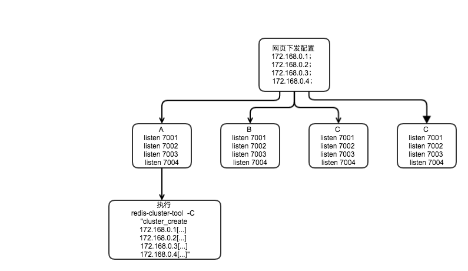

= 网关客户数据共享Redis集群方案
集群概念？
:toc:
:toclevels: 4
:toc-position: left
:source-highlighter: pygments
:icons: font
:sectnums:
:hardbreaks:

== 背景
当网关出现宕机时，用户需要重新认证体验差。
这个方案可以让每一台网关保存所有用户数据。

== 准备
* C 语言实现的创建集群小工具，需要 hiredis-vip
https://github.com/deep011/redis-cluster-tool

* 唯品会的开源代码 hiredis-vip，支持了 cluster 功能，可以代替官方的 hiredis
https://github.com/vipshop/hiredis-vip

== 配置流程图

== 网页配置
配置比较简单, 写入所有需要数据共享的网关列表，如下面4个网关 `A` `B` `C` `D`：
----
172.168.0.1;172.168.0.2;172.168.0.3;172.168.0.4
----
== 各网关实现
如网关 `A` 应该起四个实例， [blue]*端口固定* 分别为 `7001` `7002` `7003` `7004` , 各代表 `A` 的 master 和 `B` `C` `D` 的 slave
使用 shell 脚本完成这个事情

* 配置表
+
|===
|         | A (172.168.0.1)         | B (172.168.0.2)         |  C (172.168.0.3)          | D (172.168.0.4)
|instance |7001 (A [blue]*master* ) |7001 (A1 slave)           |7001 (A2 slave)             |7001 (A3 slave)
|instance |7002 (B1 slave)          |7002 (B [blue]*master* )  |7002 (B2 slave)             |7002 (B3 slave)
|instance |7003 (C1 slave)          |7003 (C2 slave)           |7003 (C [blue]*master* )    |7003 (C3 slave)
|instance |7004 (D1 slave)          |7004 (D2 slave)           |7004 (D3 slave)             |7004 (D [blue]*master* )
|===

== 集群命令
可在任何一台上操作，这里都只选 `第一台网关`

* 创建
+
----
redis-cluster-tool -C "cluster_create \
                       172.168.0.1:7001[172.168.0.2:7001|172.168.0.3:7001|172.168.0.4:7001]  \
                       172.168.0.2:7002[172.168.0.1:7002|172.168.0.3:7002|172.168.0.4:7002]  \
                       172.168.0.3:7003[172.168.0.1:7003|172.168.0.2:7003|172.168.0.4:7003]  \
                       172.168.0.4:7004[172.168.0.1:7004|172.168.0.2:7004|172.168.0.3:7004]" \
----
+
因为端口是固定的，所以只要区分 IP 就可以了。

* 销毁
+
----
redis-cluster-tool -a 172.168.0.1:7001 -C "cluster_destroy"
----

== 注意
* 如果有50台网关，那么 `7001~7050` 、`17001~17050` 端口不能被占用
* [red]*各网关启动实例检测* 必须在集群命令之前，否则集群创建命令失败。
* 两台以上 master 挂掉，切换不回来？一半以上 master fail

== 问题
. *大量节点故障出现的负载均衡问题，后面再看下。*
没有找到官方解决方案
. *切换同步问题时间？大量数据写的丢失？*
断开的话，检测一下重新连接，不会出现丢失？
. *内存，一个用户数据的占用量以及备份*
+
5万个 `KEY` `VAL` 数据，下发之前
+
----
fabius8-Lenovo:~:% ps ef -o command,vsize,rss,%mem,size |grep -E "COMMAND|redis"
COMMAND                        VSZ   RSS %MEM  SIZE
 \_ ../redis-server *:7005   34416  5996  0.2 19584
 \_ ../redis-server *:7004   34408  6008  0.2 19576
 \_ ../redis-server *:7003   34416  6036  0.2 19584
 \_ ../redis-server *:7002   35460  6100  0.3 20628
 \_ ../redis-server *:7001   35484  6076  0.3 20652
 \_ ../redis-server *:7000   35496  6156  0.3 20664
----
+
5万个 `KEY` `VAL` 数据，下发之后
+
----
fabius8-Lenovo:~:% ps ef -o command,vsize,rss,%mem,size |grep -E "COMMAND|redis"
COMMAND                        VSZ   RSS %MEM  SIZE
 \_ ../redis-server *:7005   37848  9308  0.4 23016
 \_ ../redis-server *:7004   37836  9272  0.4 23004
 \_ ../redis-server *:7003   37836  9228  0.4 23004
 \_ ../redis-server *:7002   38924 10136  0.5 24092
 \_ ../redis-server *:7001   38924 10072  0.5 24092
 \_ ../redis-server *:7000   38804 10156  0.5 23972
----
+
7万个 `KEY` `VAL` 数据下发之后
+
----
fabius8-Lenovo:cluster-test:% find . |grep appendonly.aof | xargs ls -alh
-rw-r--r-- 1 fabius8 fabius8 795K Sep 29 16:07 ./7000/appendonly.aof
-rw-r--r-- 1 fabius8 fabius8 798K Sep 29 16:07 ./7001/appendonly.aof
-rw-r--r-- 1 fabius8 fabius8 795K Sep 29 16:07 ./7002/appendonly.aof
-rw-rw-r-- 1 fabius8 fabius8 794K Sep 29 16:07 ./7003/appendonly.aof
-rw-rw-r-- 1 fabius8 fabius8 798K Sep 29 16:07 ./7004/appendonly.aof
-rw-rw-r-- 1 fabius8 fabius8 795K Sep 29 16:07 ./7005/appendonly.aof
----
+
[blue]*一台master 对应一台 slave, 5万个键值占用4000KB 内存, 7万个占用 700KB 的文件大小*

. *客户端感知集群？写出实例*
hiredis 不支持 cluster，hiredis-vip 支持，测试 OK

== 主备模型
* 全备份，一台备份所有
* 环备份，一台备份下一台

== 环备份
以上均是全备份，以下为环备份, 不想修改上面部分，请见谅。

=== 集群命令

* 创建
+
----
redis-cluster-tool -C "cluster_create \
                       172.168.0.1:7001[172.168.0.2:7002]  \
                       172.168.0.2:7001[172.168.0.3:7002]  \
                       172.168.0.3:7001[172.168.0.4:7002]  \
                       172.168.0.4:7001[172.168.0.1:7002]" \
----
+
因为端口是固定的，所以只要区分 IP 就可以了。

* 销毁
+
----
redis-cluster-tool -a 172.168.0.1:7001 -C "cluster_destroy"
----

