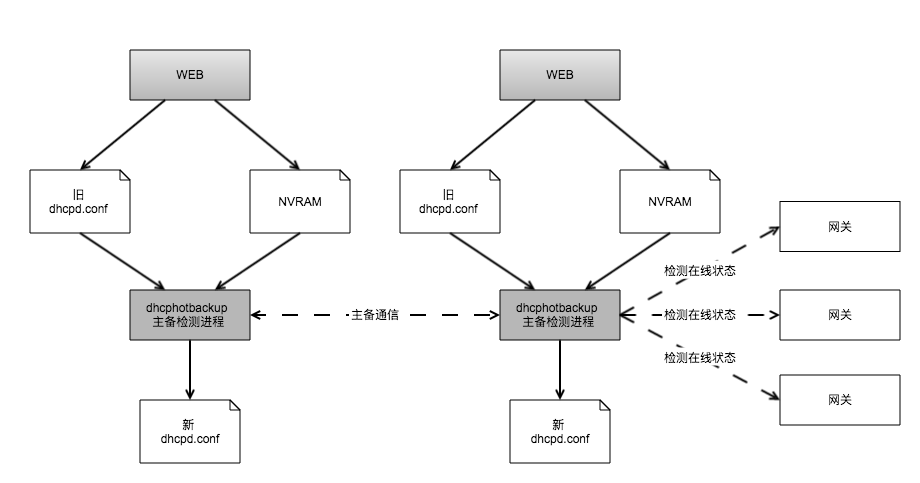
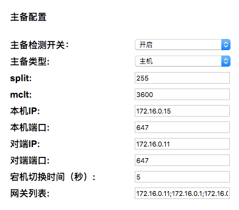
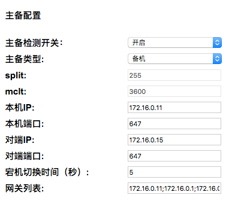

= DHCP 网关负载均衡
CGW
:toc:
:toclevels: 4
:toc-position: left
:source-highlighter: pygments
:icons: font
:sectnums:

== 背景
外场组网方式是多台 CGW3000 网关在同一局域网内，每个网关上都有一个 DHCP 服务器。 +
而多个 DHCPD 服务存在问题较多，如会出现 [red]*以下问题* ：

. 其中一台网关 CGW3000 挂掉, 用户地址即发生改变。 +
. 终端漫游, 无法保证用户地址一致。

[blue]*解决方法* ： +

* 利用 `取模算法` 将 DHCP `option routers` 分散地指向网关
* DHCP 热备功能支持

== 方案设计
两台 CGW3000 作主备切换, 利用 failover 协议。其他普通网关通过主机的 `ping` 监控在线状态。 +
开发 `dhcphotbackup` 主备检测进程增加以下功能: +

* 读取 `nvram` 配置 +
* 检测网关不在线，重新生成配置 `dhcpd.conf`

=== 总体设计

=== WEB 设计
* failover 参数
. 本机类型
. 「mclt」「split」默认分别为 `1800` ， `255` 即可
. 本机服务器 IP、PORT
. 对端服务器 IP、PORT

* gateway 参数
. 网关 IP 列表以及数目

=== failover配置
参考官方配置方式：
link:https://kb.isc.org/article/AA-00502/0/A-Basic-Guide-to-Configuring-DHCP-Failover.html[ DHCP主备配置方法] +
IETF 文档:
link:https://tools.ietf.org/html/draft-ietf-dhc-failover-12[draft-ietf-dhc-failover-12] +

TIP: 1. 主备机时间不能差距过大，[red]*确保时钟同步!!!*  +
2. 网络配置, 第一次需要 [red]*双方通信!!!* 否则不可用 +

* 主机配置
+
----
   failover peer "failover-partner" {
        primary; <1>
        address dhcp-primary.example.com; <2>
        port 519;  <3>
        peer address dhcp-secondary.example.com; <4>
        peer port 520; <5>
        max‐response‐delay 60;
        max‐unacked‐updates 10;
        mclt 3600; <6>
        split 128; <7>
        load balance max seconds 3;
    }
----

* 配机配置
+
----
   failover peer "failover-partner" {
        secondary; <1>
        address dhcp-secondary.example.com; <2>
        port 520; <3>
        peer address dhcp-primary.example.com; <4>
        peer port 519; <5>
        max‐response‐delay 60;
        max‐unacked‐updates 10;
        load balance max seconds 3;
    }
----

* subnet/pool 生效配置
+
----
   subnet 10.100.100.0 netmask 255.255.255.0 {
        option domain-name-servers 10.0.0.53;
        option routers 10.100.100.1;
        pool {
             failover peer "failover-partner";
             range 10.100.100.20 10.100.100.254;
        }
   }
----

=== 配置策略
分配 option routers 策略:

* 获取用户标识，取模运算, 这里是 32 台网关,获取 `%32` 之后的值 +
+
----
set local-group = ((extract-int (suffix
                                (pick-first-value
                                    (option dhcp-client-identifier, hardware), 1), 8) % 32));
----
+
----
switch (local-group) {
case 0:
option routers 192.168.111.1;
break;

case 1:
option routers 192.168.111.2; <1>
break; <2>

case 2:
option routers 192.168.111.3;
break;

....

case 31:
option routers 192.168.111.32;
break;
}
----
+
* 当一台网关挂掉 同时注释上面 `标注的<1> <2>` 重新生成配置
+
----
case 2:
#option routers 192.168.111.2;
#break;
----
+

* 保证原有功能的不受污染，web 配置下，原来的配置保持不变。
将所有的主备配置写入 `nvram` 中。 +
由 `dhcphotbackup` 获取 `nvram` 中的值。

* dhcpd.conf 在web 刚刚下发的配置时，主备配置未生效, 主备配置生效之后, 在 `dhcpd.conf` 第一行插入:
+
----
#failover_configured
----

=== 网关在线检测
简单的 `ping` 检测, 周期 `10s`

=== 宕机情况
* 主机挂了
. 备机重新生成 `dhcpd.conf`
. 备机地址池生效
. 备机接管 `ping` 检测
* 备机挂了
. 主机重新生成 `dhcpd.conf`
* 普通网关挂了
. 处理与备机一样, 同上

== 测试方法
* 确保 [red]*时间同步* , 局域网内各个网关可以访问
* 对两台网关进行页面配置, `split` `mclt` 默认即可
+
[blue]*主机配置* ： +
+

[blue]*备机配置* ： +
+

* 各个网关拔网线。查看用户拿到地址是否如预期效果。
* 查看主备工作正常方法：
+
----
[root@CGW4700T ~]# cat /mnt/failover/failover.leases | grep -A 3 failover

failover peer "failover-partner" state {
  my state communications-interrupted at 1 2016/11/07 02:31:38;
  partner state normal at 5 2016/11/04 09:14:41;
}

failover peer "failover-partner" state {
  my state normal at 1 2016/11/07 02:31:38;
  partner state normal at 5 2016/11/04 09:14:41;
}
----

TIP: 原先leases文件在/dev/shm，（5万个地址数量）第一次初始化时间为8秒。
现在放到了/var/db，第一次初始化时间需要8分钟，以后就不需要这么长时间了。(废弃，已修复)

== 测试报告
